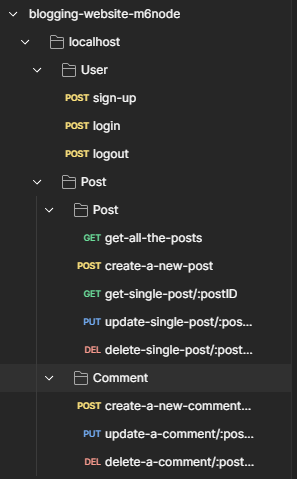

# Blogging Website (Module #6, MERN Stack)



## Objectives

created a RESTful API for a blog application. The API will handle user authentication, CRUD operations for posts, and CRUD operations for comments.

## How to install and run in yours local machine

```bash
npm install
npm run start
```

## User Authentication Endpoints

## POST /user/sign-up

### Purpose:

Create a new user.

### Request Body:

```javascript
json
{ "email": "user@example.com", "password": "password123" }

```

### Response:

Confirmation message or user details.

## POST /user/login

### Purpose:

Authenticate a user and provide a JWT token.

### Request Body:

```
json
{ "email": "user@example.com", "password": "password123" }
```

### Response:

JWT token on successful authentication.

## POST /user/logout

### Purpose:

Invalidate the current user's session.

### Headers:

Requires JWT token.

### Response:

Confirmation message.

## Post Endpoints

## GET /post/get-all-the-posts

### Purpose:

Retrieve all posts.

### Response:

Array of posts with author details.

## POST /post/create-a-new-post

### Purpose:

Create a new post.

### Headers:

Requires JWT token.

### Request Body:

```
json
{ "title": "Post Title", "content": "Post Content" }
```

### Response:

Details of the created post.

## GET /post/get-single-post/:postID

### Purpose:

Retrieve a single post by ID.

### Response:

Post details with author information.

## PUT /post/update-single-post/:postID

### Purpose:

Update a post by ID.

### Headers:

Requires JWT token.

### Request Body:

```javascript
json
{ "title": "Updated Post Title", "content": "Updated Post Content" }
```

### Response:

Updated post details.

## DELETE /post/delete-single-post/:postID

### Purpose:

Delete a post by ID.

### Headers:

Requires JWT token.

### Response:

Confirmation message.

## POST /post/create-a-new-comment/:postID

### Purpose:

Create a new comment for a specific post.

### Headers:

Requires JWT token.

### Request Body:

```javascript
json
{ "content": "Comment Content" }
```

### Response:

Details of the created comment.

## PUT /post/update-a-comment/:commentID

### Purpose:

Update a comment by ID.

### Headers:

Requires JWT token.

### Request Body:

```javascript
json
{ "content": "Updated Comment Content" }
```

### Response:

Updated comment details.

## DELETE /post/delete-a-comment/:postID/:commentID

### Purpose:

Delete a comment by ID.

### Headers:

Requires JWT token.

### Response:

Confirmation message.

## Tech. Stack Used:

- [MongoDB](https://www.mongodb.com/)
- [ExpressJS](https://expressjs.com/)
- [ReactJS](https://react.dev/)
- [NodeJS](https://nodejs.org/en/)
- [PassportJS](https://www.passportjs.org/)

## Author

[Abhishek kumar](https://www.linkedin.com/in/alex21c/), ([Geekster](https://geekster.in/) MERN Stack FS-14 Batch)
